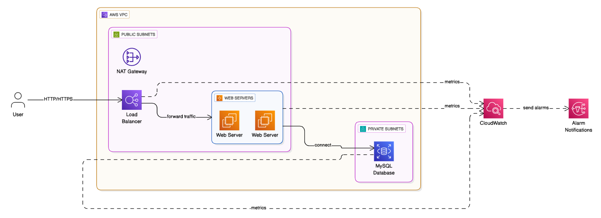

# LAMP Stack AWS CDK Infrastructure



## Overview

This project provisions a **scalable, secure, and highly available LAMP stack** (Linux, Apache, MySQL, PHP) on AWS using the AWS Cloud Development Kit (CDK) in Python. The stack is designed following AWS Well-Architected Framework best practices for reliability, security, and maintainability.

- **Infrastructure-as-Code:** All resources are defined using AWS CDK (Python).
- **Modern Architecture:** Public/private subnets across two AZs, Application Load Balancer, EC2 Auto Scaling, RDS MySQL, and secure networking.
- **App Integration:** The PHP application code is located in the [`lamp`](lamp) directory and is automatically deployed to web servers from a GitHub repository.

---

## Architecture

- **VPC:** 2 public and 2 private subnets across 2 Availability Zones
- **EC2 Auto Scaling Group:**
  - Web servers in public subnets (with public IPs for SSH and HTTP access)
  - Connected to an Application Load Balancer (ALB)
  - SSH enabled with your EC2 key pair
- **Application Load Balancer:**
  - Internet-facing, routes HTTP traffic to web servers
- **RDS MySQL:**
  - Multi-AZ, deployed in private subnets for security
  - Only accessible from the web server security group
- **Security Groups:**
  - Least privilege: Only necessary ports are open (HTTP/HTTPS/SSH for web, MySQL for DB)
- **User Data Automation:**
  - Installs Apache, PHP, and app dependencies
  - Clones your PHP app from GitHub
  - Generates a `.env` file for DB connection (used by [`lamp`](lamp) app)

See the full architecture diagram above: 

---

## PHP Application

- The main PHP application is located in [`lamp`](lamp).
- It uses a `.env` file for database configuration, which is auto-generated by the EC2 user data script.

## Deployment Instructions

1. **Install dependencies:**

   ```bash
   python -m venv .venv
   source .venv/bin/activate
   pip install -r requirements.txt
   npm install -g aws-cdk  # if not already installed
   ```

2. **Bootstrap your AWS environment (first time only):**

   ```bash
   cdk bootstrap
   ```

3. **Deploy the stack:**

   ```bash
   cdk deploy --context github_repo_url=https://github.com/eugene-sew/gtp_lampstack_lab_app.git
   ```

4. **Access your application:**

   - Find the Load Balancer DNS in the stack outputs or AWS Console
   - Open in your browser to verify deployment

5. **SSH into EC2 instances:**
   - Use your key pair (e.g., `ssh -i LAMP_kp.pem ec2-user@<instance-public-ip>`)
   - Public IPs are assigned automatically

---

## Security Notes

- **SSH (port 22) is open to the world by default for debugging.** Restrict this in production!
- RDS is only accessible from the web server security group (never publicly exposed).
- All resources are tagged for project and environment tracking.

---

## Cleaning Up

To avoid ongoing AWS charges, destroy the stack when done:

```bash
cdk destroy
```

---


## Security Features

- VPC with public and private subnets
- Security groups with least privilege access
- Database in private subnet
- Web servers in private subnet with access through load balancer only

## Scaling Features

- Auto Scaling Group for web servers based on CPU utilization
- Multi-AZ RDS deployment for high availability
- Application Load Balancer for traffic distribution

-- View implementation details at 
